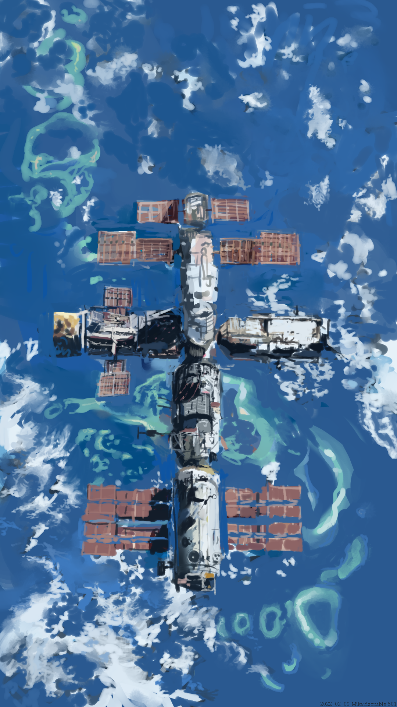

# 144階　案内所

## 主要コンテンツ
[ページ一覧](1)
[案内所](144)
[旧トップ](100)

[絵](129)
[曲](145)
[小説](146)

## 絵
[絵](129)　絵のターミナル
[イラストランダム表示](5)
[旧イラストトップ](5)
[plot](90)

## 架空惑星
[架空惑星ギャラリー](23)

## 架空地図
工事中

## 数学
[o](83)
[o](80)
[o](81)
[o](82)
[o](84)
[o](85)
[o](86)
[o](87)
[o](88)
[o](89)

## フォント
[フォントデモ・ダウンロード](12)

## ほか
[人工言語の挨拶一覧](42)
[vrchatで製作したワールド](22)
[illust random](5)
[ツイッターハッシュタグノート](133)

Link
[一方的リンク](142)
[インターネット目録](128)
- [旧インターネット目録](21)

About
[みかぶるについて](143)
[このサイトについて](37)

## トップページアーカイブ
- [初代トップ](27)
- [2代目トップ](100)
- 3代目トップ
  - [3代目トップa](104)
  - [3代目トップb](105)
  - [3代目トップc](107)
  - [3代目トップd](108)
  - [3代目トップe](109)
  - [3代目トップf](115)
- [4代目トップ](116) 
- [5代目トップ](106)
- 6代目トップ
  - [6代目トップ](126)
  - [6代目トップ](127)

## ツール
- [リンク変換ツール](121)

## 遊び
- [東京の温湿度](29)　気象庁のAPI遊び
- [時刻](28)　JS遊び

- [140](140)
- [141](141)
- [142](142)
- [notes](notes)

<a href="./129" class="linkcard">イラスト</a>
<a href="./8" class="linkcard">写真</a>
<a href="./129" class="linkcard">架空惑星</a>

### [ホームへ戻る](./index.html)