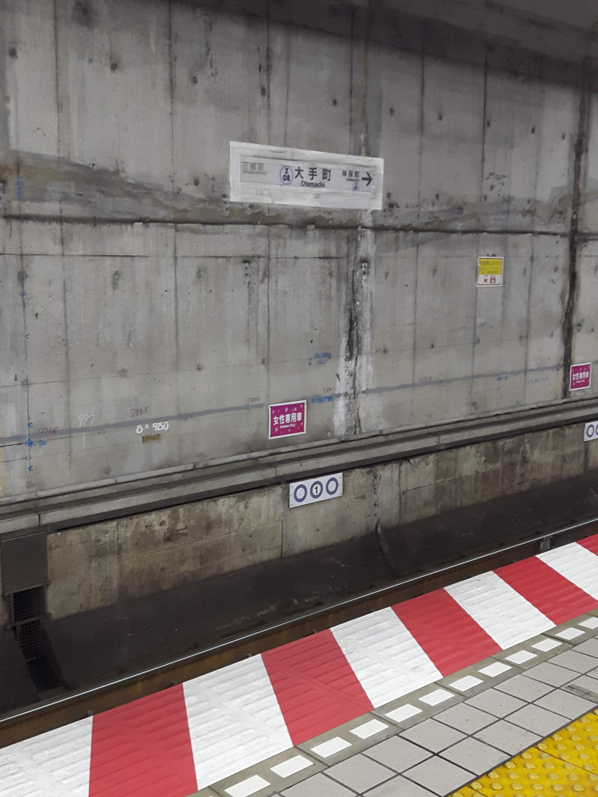

# 155階　駅構造情報
[ホームへ戻る](./index)　[案内所へ戻る](144)　[写真ハブへ戻る](154)

\#駅構造情報　とは、駅の配管などの趣深い有機的造形を愛でるハッシュタグである

## 100

### 名古屋駅

### 目黒駅

### 大手町

### 大阪のどこか

### 不明

## 200

## 300

## 400

## 500

## 600

[ホームへ戻る](./index)　[案内所へ戻る](144)　[写真ハブへ戻る](154)
