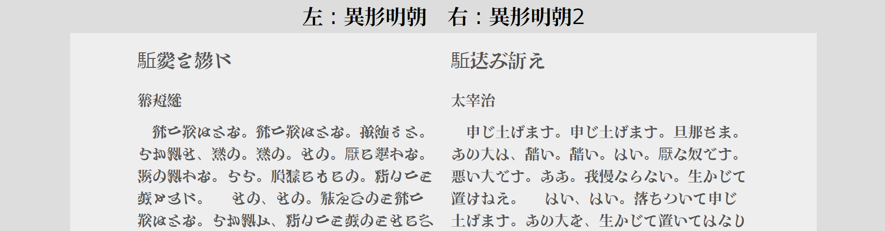

# フォント
[ホーム](./index.html)　[ロビー](144)

## AI生成カラーフォント自動改札

源ノ明朝やSourceHanSansをACertainThingでimg2imgして得た画像を、自作ツールで色ごとに分解し白黒画像を得て、自作ツール[png2ttf](https://github.com/Mikanixonable/png2ttf)で各色をフォント化、各フォントに色を指定して合成しOpentype-svgフォントにし、fontlabでCOLRカラーフォントにした。
上からJidouKaisatsu, JidouKaisatsuB, JidouKaisatsuC
[GitHub↗](https://github.com/Mikanixonable/IgyouMincho/tree/main/ttf/color)

## 異形明朝

[png2ttf](https://github.com/Mikanixonable/png2ttf)でつくった
[デモページ](57)

## その他
[フォントデモ・ダウンロード](18)　実際に打ち込んで遊べる
[シリーズ一覧](4)　いろんな種類がある
[犯行予告風世界人権宣言](41)　ネタページ