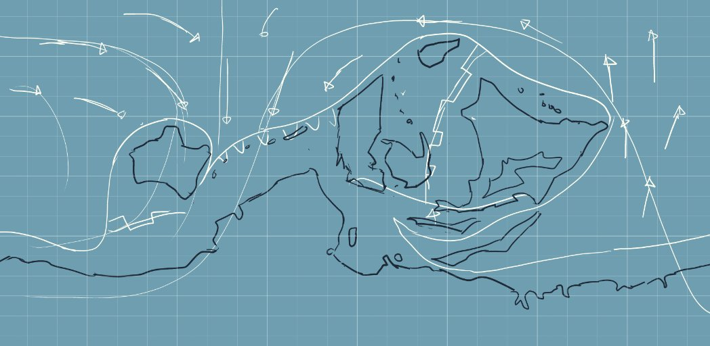
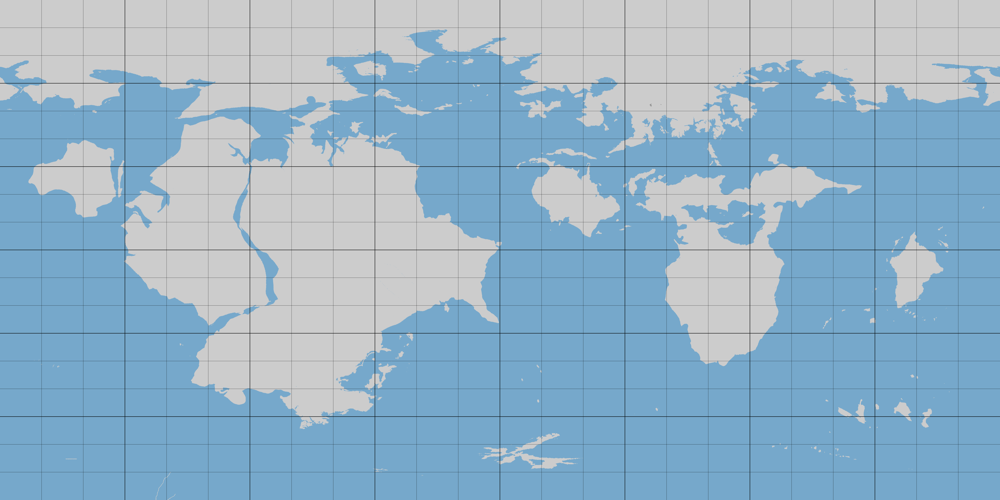
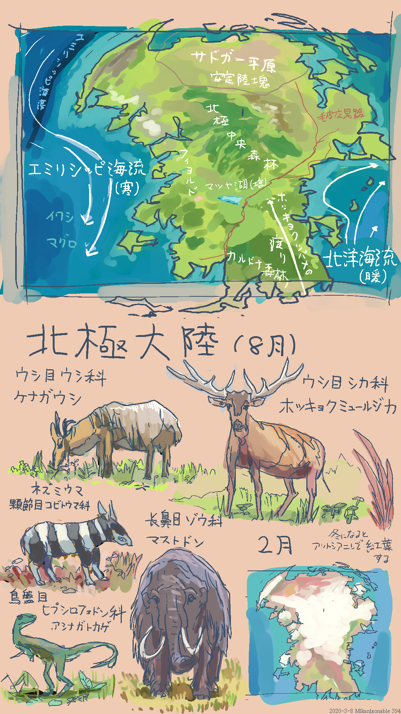
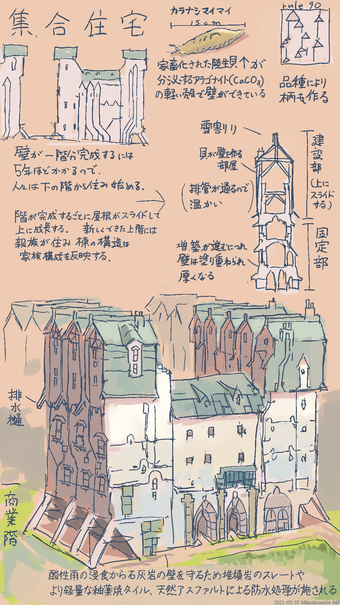

[ホーム](./index.html)　[ロビー](144)　
# 166階　架空世界
このページでは私の世界創作(conworld)趣味でつくった資料を展示しています。

### AE(2023-)

図166-2 AEのテクトニック図案(正積円筒図法)

[AEの創作トップ](175)

|概要||
|---|---|
|名称|alt-earth(AE)、異地球、アリアテラ|
|創作状況|2023年以降製作中|
|特徴|ガス惑星「モルン」を周回するハビタブルな衛星で、南半球の南緯30付近までは「南方大陸」または「テラ・アウストラリス」とよばれる超大陸が広がり、テクトニックな地溝帯に海が侵入し分裂しつつある。本初子午線付近にはコールドプルームによりいくつかの大陸群(AE世界内では大陸は南方大陸に対する固有名詞で、それ以外の大陸は「州」と呼ぶ)が「月の海」とよばれる海を囲むように集まり、新期造山帯が分布する。地図中心付近の内半球では空の同じ位置に視野角約30度で常にモルンが見え、夜も明るいが、毎日約2時間は日食により闇夜になり、雨が降る。地図外側の外半球は、超海洋である「星の海」が広がり、モルンの外側の衛星が常に空に見える。地磁気が弱いため、方位磁針が使えない。|

## PE(2017-2023)

図166-1 PEの正積円筒図法

[PEの創作トップ](179)

|概要||
|---|---|
|名称|para-earth、proto-earth(PE)、異地球、テラアリウス|
|創作状況|2017年から-2023年まで製作、大陸配置に納得がいかず、製作は中止|
|特徴|自転軸が42度傾く。地球よりはやや小さい。北極にある「北極大陸」は冬には分厚い雪に覆われるが、夏には草原地帯になる。地図東側の中緯度大陸とラグハ大陸からは、先史時代の人間の狩猟圧で馬が家畜化される前に絶滅したため、民族の移動速度が現世よりもはるかに遅い。そのため、民族移動がおこりにくく、言語・文化の多様さが現世よりも多様になっている。テクトニクスは、ウィルソンサイクルでの超大陸分裂期に当たるため、海洋底の更新によって海の水深が浅いため、海水があふれだしほとんどの大陸棚が浅海に沈んでいる。そのため浅海の面積が広く海洋の生物生産性が高い。陸の根拠地を持たない船上民がいる。環があったりなかったりする|

歴史や生物の詳しい設定は、設定がまとまる前に創作を中止したので公開していない。3Dモデルや地図やいくつかのイラストはある。

No.394 2020-03-08

No.448 2021-03-16

[ホーム](./index.html)　[ロビー](144)　[ラウンジ](159)　[アトリウム](160)

### 外部リンク
[tanukipedia利用者ページ](https://tanukipedia.miraheze.org/wiki/%E5%88%A9%E7%94%A8%E8%80%85:Mikanixonable)

### 他の方の創作の紹介
[蒼い雪国](https://kitakami7kouren.jimdofree.com/)　日本風の架空世界と架空地図

### 架空系創作関連ページ
[人工言語ハブ](128)
[架空世界ハブ](166)
[架空惑星ハブ](136)
[架空地図ハブ](162)

