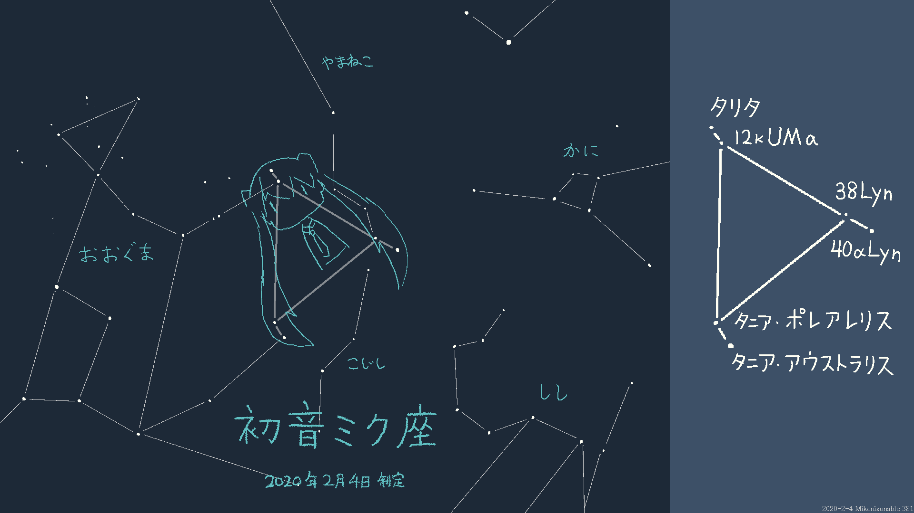
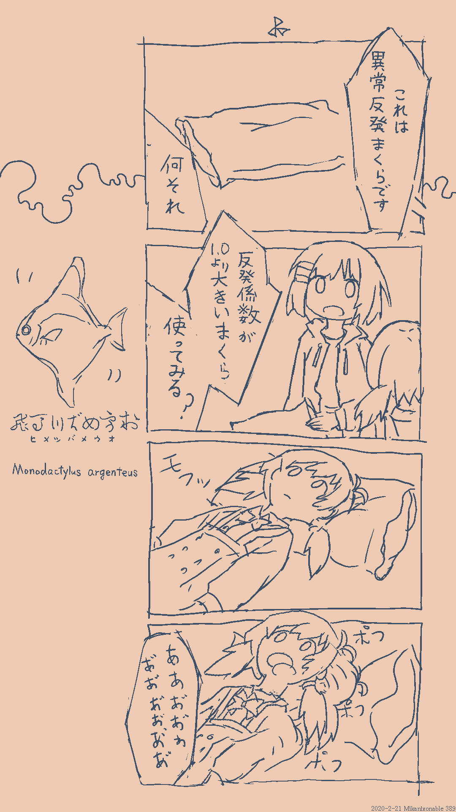
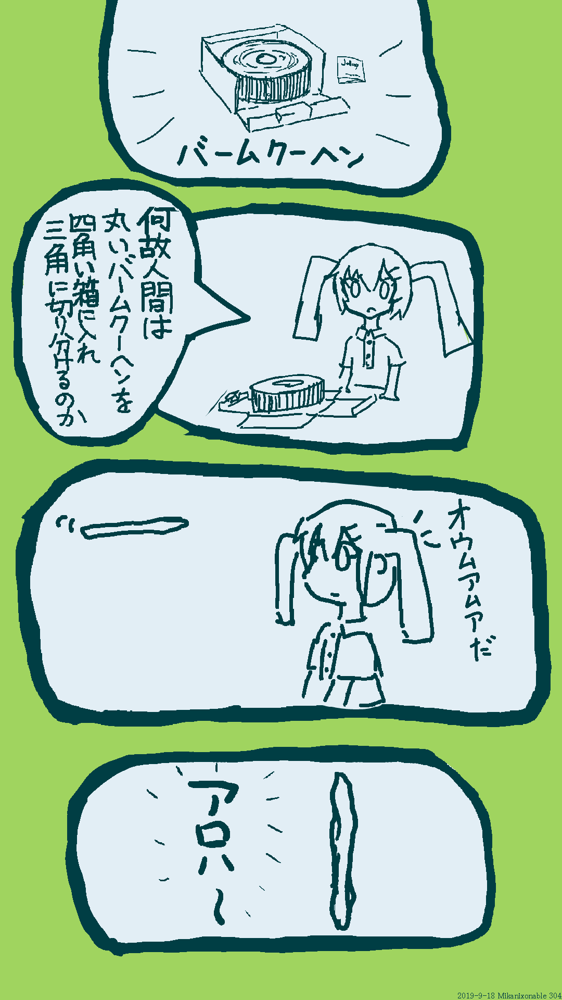
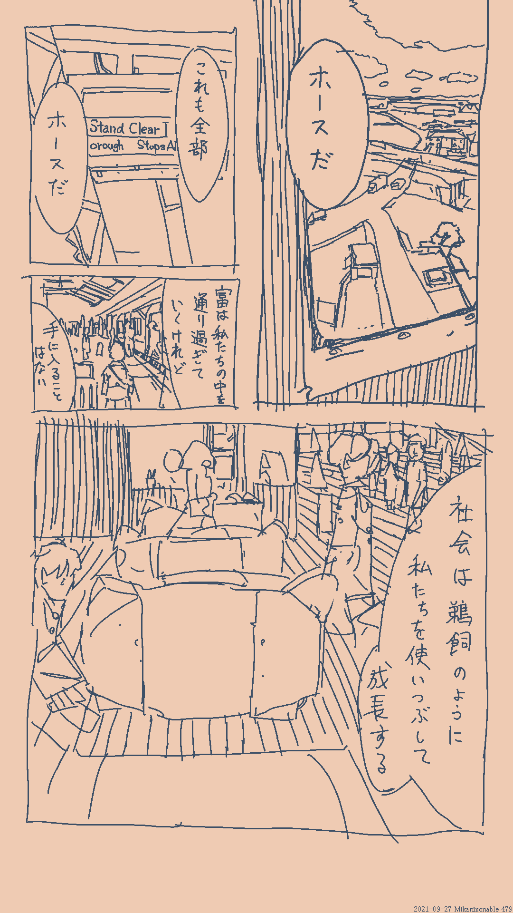
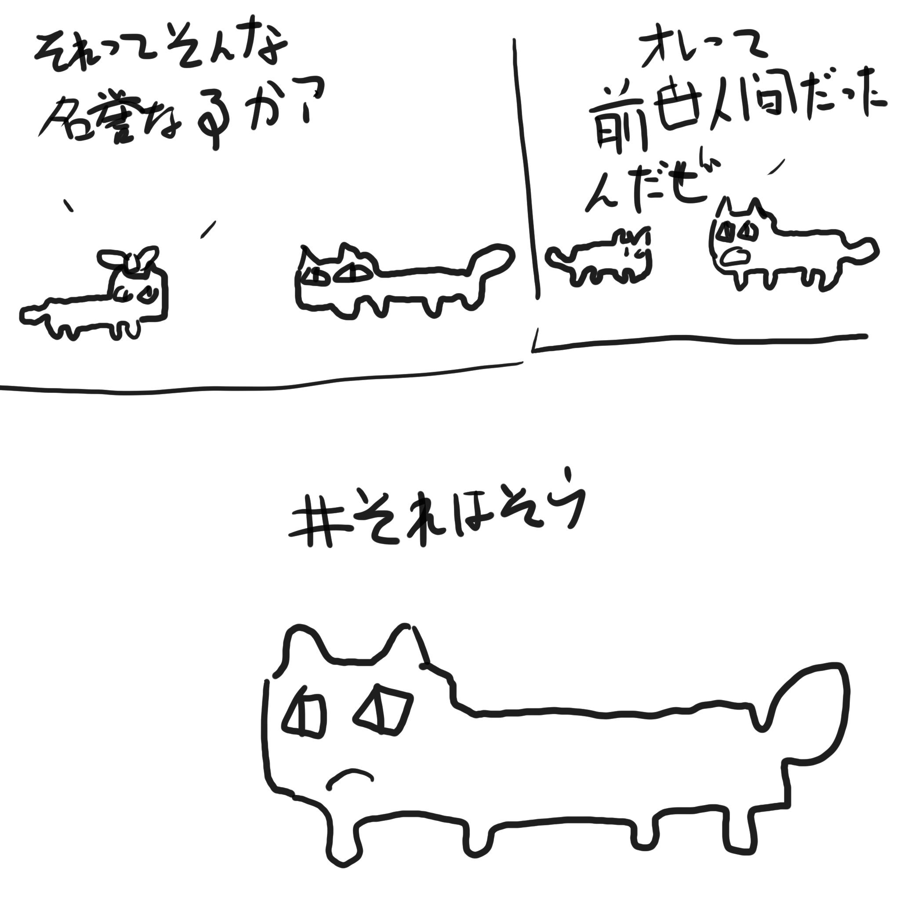

# 167階　その他の創作物

## 初音ミク座

初音ミク座は春の星座で、伝統的な星座ではおおぐま座とやまねこ座の領域にあるが、星のまとまりからして初音ミク座としてひとまとめに考えた方が見つけやすいと思い、制定した。3角形の頂点に星が2つずつならぶ6つの星からなる星座で、タリタ、12kUMα、38Lyn、40αLyn、タニアポレアレリス、タニアアウストラリスからなる。
2020年2月4日制定

## nコマ漫画

389

304

220

517

479

-214

## 短歌みたいなもの
季語は知らない

>エンジンの馬力について考える
空想上の馬がうごめく

>消しゴムが使い切られて消えるのを
本当に見た人間はいない

>第四紀完新世の沖積層
圏界面まで飛ばす水爆

>靴底をこすらせ鳥の鳴き声を
淡々と出すバスケの朝練

>シャーペンの芯を詰めかえ消しゴムの
中央についた黒点を見る

[その他の短歌作品](168)

## 漢詩
>孤　𠷡　夏　閑　　　百
絶　友　虫　窓　　　合
如　経　不　已　　　漢
地　幾　超　晩　　　詩
蜩　年　冬　夏

閑窓(かんそう)已(すで)に晩夏
夏虫冬を超えず
𠷡友(もうゆう)幾年か経る
孤絶地蜩(ちちょう)の如し

寂しげな窓の外はもう晩夏だ
虫は冬を越えない
私の百合友達は何年続くだろうか
孤独は地中の蝉のようだ

平仄
○　●　●　○
●　●　●　○
△　○　△　●
●　○　○　●
◎　○　◎　●

○：平
●：仄
△：決まらない
◎：押韻
いろいろ調べたけどちゃんと漢詩になっているかどうか自信ない

## 川柳
#n575はツイッターの川柳のタグである。

>おくじょうで
ごりらうほうほ
ねったいや

>IKEAから
さめがたくさん
やってきた

## 平成自由詩

平成自由詩とは、現代の日本人が漢詩風に読んだ平仄も韻も踏まず文字数だけ漢詩風に5や7にしてある詩のことである。江戸中期に流行した狂詩の系譜にあるともいわれる。日中のオタクが適当な漢字語で会話する「偽中国語」にも似たミームである。茨城空港の開港を祝い自衛隊を称えた「強靭意思反対耐」の句がとくに有名である。私も一句だけ平成自由詩を詠んだことがある。

>布団吸身体
身体吸布団
外世界如何
不可勝吸枕

    「布団、身体を吸う
    身体、布団を吸う
    外なる世界は如何
    勝げて吸うべからず」

    ~布団は体を吸い、体は布団を吸う
    外の世界はどうであろうか、とても吸いきれないほどだ~

## 極度定型詩

「SuperDry 極度乾燥(しなさい)」とは、2017年ごろに日本語圏で話題になった欧米の自動翻訳風の高級ファッションブランドである。この間の抜けた響きに触発されて、私は定型詩のハッシュタグを作った。それが「#極度定型詩」である。極度定型詩は、私の他にもロユカさんやhsjoihsさんが詠んでくれた。

>極度描画(はかどらない)
極度完成(しなさい)
入眠時間(うしろにしかずれない)
極度反省(しなさい)

>極度天候(あつい)
極度乾燥(しなさい)
気候変動(たたかい)
無風之窓(つらい)

>高圧鉄塔(はてない)
関東平野(ひらたい)
極度乾燥(つめたい)
冬の寒村(わびしい)

>極度素描(できたい)
百度百科(よめない)
角度太陽(つめたい)
吐息白化(akveroj)

>極度空腹(たべたい)
甘露食卓(おいしい)
曲度腹面(おおきい)
極度朝食(たべたい)

>極度財力(ください)
一度芸術(びびしい)
甘露食卓(おいしい)
文化生活(たのしい)
極度渇望(やりたい)

>極度進捗(だせない)
極度戒飭(しなさい)
極度安直(にげたい)
極度完走(しなさい)

[ホーム](./index.html)　[ロビー](144)　[ラウンジ](159)　[アトリウム](160)

