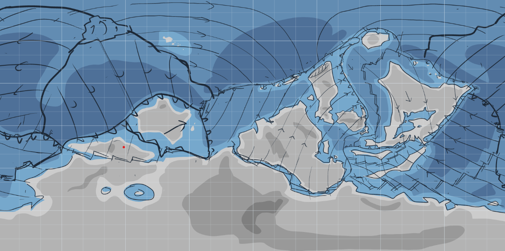

[架空世界トップ](166)

# 175階 異地球

図175-1 AEのテクトニック図(正積円筒図法)

　AE(alternative earth, alt-earth)または異地球またはアリアテラは、失われた人類の多様性をテーマにした異世界創作です。2017年から2023年まで創作していたPEに替わって2023年から製作を始めました。AE内の住人は、この惑星のことを単に地球と呼んでいますが、それでは現実の地球と区別できないので、創作としてこの惑星を言及するときに「AE」という語を使っています。
　AEガス惑星「モルン」を周回するハビタブルな衛星で、南半球の南緯30付近までは「南方大陸」または「テラ・アウストラリス」とよばれる超大陸が広がり、テクトニックな地溝帯に海が侵入し分裂しつつある。本初子午線付近にはコールドプルームによりいくつかの大陸群(AE世界内では大陸は南方大陸に対する固有名詞で、それ以外の大陸は「州」と呼ぶ)が「月の海」とよばれる海を囲むように集まり、新期造山帯が分布する。地図中心付近の内半球では空の同じ位置に視野角約30度で常にモルンが見え、夜も明るいが、毎日約2時間は日食により闇夜になり、雨が降る。地図外側の外半球は、超海洋である「星の海」が広がり、モルンの外側の衛星が常に空に見える。地磁気が弱いため、方位磁針が使えない。

## 異地球の歴史

## AE世界と現実との対応の解釈
　AEでは、人間の文化というテーマを中心に地球とは異なる世界を創作しているため、人間の文化という概念から遠ざかるにつれて現実宇宙との違いが大きくなっていきます。AEには地球とほぼ同等の生物や物理法則が存在しますが、地球とは環境が異なるので、地球にある対応物とはどれも微妙に異なっています。例えば、ホモサピエンスは地球にもAEにもいますが、AEの環境は地球とは異なっているので、地球とは遺伝子型の頻度や血液型の比率が異なります。他の生物や概念についても同じです。これらの現実世界とAE世界の対応関係は、AEの宇宙の法則によるもので、他の創作に見られるような「広い宇宙のどこかにたまたま人間界と近い世界がある」というようなものではありません。

## AE世界の起源と直交時間
AE世界は、ネイティブアメリカンの神話の拡張という枠物語を採用しています。それによれば、AEは創造神から発生した2番目の地球であり、現在の宇宙や地球は、滅びた前の世界から地下の細い穴をつたって人が移住してできた、人間にとって3番目の宇宙です。その傍証として、人間の体内時間が第3地球の24時間ではなく、第2地球の27時間近いサイクルを持っていることや、記号の多重な創発性がこの宇宙でもみられること、人間に意識のハードプロブレムがこの宇宙でも存在するなどがあります。これは時間的空間的に完全な斉一性をもった物理法則が支配する第3地球に残されている、物理法則に矛盾しない程度の記号の魔術的要素(魔法的な概念)です。
　人間の概念的な起源(この宇宙内での物質的な起源ではない)は、概念世界であり、人間はかつて純粋な概念のあふれる世界で暮らしていました。第一地球は、神や霊魂、天使、擬人化などにあふれる人間の生得記憶に親和的な世界でした。第一地球は球体ではなく、平面やさまざまな形を取っていました。第一地球は、人口の増加と人間の知能の発達、絵や文章などの記録によって、世界を観察し一貫性をもたせる主体が増えたために、世界の不安定な法則に矛盾が生まれ崩壊し、より矛盾の少ない次の第二地球が誕生しました。
　AE(第2地球)は体系的な物理法則と記号操作による魔法の体系の両方が存在していた宇宙です。第二地球は現実の宇宙と似て100億年を超える時間とほぼ無限の空間、熱力学までの物理法則という現在の第三地球に近い要素を備えていますが、あらゆる記号が実存として意識をもち、かつ物質世界にフィードバックを起こす機構(魔法)が存在していました。第二世界の人類が書記言語を発明すると、記号のもつ現実へのフィードバック能力に気づいた人類は、魔法を効率的に利用するために、簡潔な文法を持った人工言語や、都市や国家単位で脳内の概念空間を厳密に定義しすり合わせ「意味の雲」と呼ばれる概念空間を作り、強力な魔法を使用するようになりましたが、魔法は世界を物理法則から外れた方向に改変する作用なので、人口の増加や魔法の文法の改良によって魔法の使用量が増えるにつれ、世界のありうる可能性はさらに小さくなっていきました。2千年紀の中盤に、第二地球の文明は物理法則をハックし、産業革命によって人口爆発を起こしました。精密機械技術の発展は、やがて人工実存(魔法を使える機械)を作り出し、最終的に、物理的には定常宇宙である第二宇宙を成り立たせる根拠となっていた宇宙項の起源である魔法の認知斥力(負重力)の存在を利用して、強い負重力の近くに計算機をおくことで、相対的な時間の加速を利用して無限の計算資源を得ようと試みました。第二0作による負重力によってさらに計算が加速するフィードバックが起こり、新しく誕生した強力な世界改変主体(フィードバックに入った負重力計算機)により第二世界は崩壊しました。
　第二宇宙の最後に存在した計算機による世界の改変で、現在のような時間軸で140億年近い広さをもつ宇宙が誕生しました。これは「気まぐれな全知全能者が、一旦世界の管理者権限を放棄してしまうと、以降は物理法則に従ってしか宇宙が進行しなくなる」という、不安定系→案定系の物語でもあります。

[ホーム](./index)　[ロビー](144)

