[ホーム](./index)　[架空世界トップ](166)　[ロビー](144)

# 179階 Proto Earth

図166-1 PEの正積円筒図法

 <iframe title="PE" frameborder="0" allowfullscreen mozallowfullscreen="true" webkitallowfullscreen="true" allow="autoplay; fullscreen; xr-spatial-tracking" xr-spatial-tracking execution-while-out-of-viewport execution-while-not-rendered web-share src="https://sketchfab.com/models/20a8f56657da42619e40cc152970679c/embed"> </iframe> 
 <a href="https://sketchfab.com/3d-models/pe-20a8f56657da42619e40cc152970679c?utm_medium=embed&utm_campaign=share-popup&utm_content=20a8f56657da42619e40cc152970679c" target="_blank" rel="nofollow" style="font-weight: bold; color: #1CAAD9;"> PE </a> by <a href="https://sketchfab.com/Mikanixonable?utm_medium=embed&utm_campaign=share-popup&utm_content=20a8f56657da42619e40cc152970679c" target="_blank" rel="nofollow" style="font-weight: bold; color: #1CAAD9;"> Mikanixonable </a> on <a href="https://sketchfab.com?utm_medium=embed&utm_campaign=share-popup&utm_content=20a8f56657da42619e40cc152970679c" target="_blank" rel="nofollow" style="font-weight: bold; color: #1CAAD9;">Sketchfab</a>

標高3D

 <iframe title="PEbiome" frameborder="0" allowfullscreen mozallowfullscreen="true" webkitallowfullscreen="true" allow="autoplay; fullscreen; xr-spatial-tracking" xr-spatial-tracking execution-while-out-of-viewport execution-while-not-rendered web-share src="https://sketchfab.com/models/e76397f7b1fe49f58b17cf475aa8c62a/embed"> </iframe> 
 <a href="https://sketchfab.com/3d-models/pebiome-e76397f7b1fe49f58b17cf475aa8c62a?utm_medium=embed&utm_campaign=share-popup&utm_content=e76397f7b1fe49f58b17cf475aa8c62a" target="_blank" rel="nofollow" style="font-weight: bold; color: #1CAAD9;"> PEbiome </a> by <a href="https://sketchfab.com/Mikanixonable?utm_medium=embed&utm_campaign=share-popup&utm_content=e76397f7b1fe49f58b17cf475aa8c62a" target="_blank" rel="nofollow" style="font-weight: bold; color: #1CAAD9;"> Mikanixonable </a> on <a href="https://sketchfab.com?utm_medium=embed&utm_campaign=share-popup&utm_content=e76397f7b1fe49f58b17cf475aa8c62a" target="_blank" rel="nofollow" style="font-weight: bold; color: #1CAAD9;">Sketchfab</a>

気候区分3D

 <iframe title="PEtectonics" frameborder="0" allowfullscreen mozallowfullscreen="true" webkitallowfullscreen="true" allow="autoplay; fullscreen; xr-spatial-tracking" xr-spatial-tracking execution-while-out-of-viewport execution-while-not-rendered web-share src="https://sketchfab.com/models/7128bbed7c6b4dde8ea5e6d7dda86bdc/embed"> </iframe> 
 <a href="https://sketchfab.com/3d-models/petectonics-7128bbed7c6b4dde8ea5e6d7dda86bdc?utm_medium=embed&utm_campaign=share-popup&utm_content=7128bbed7c6b4dde8ea5e6d7dda86bdc" target="_blank" rel="nofollow" style="font-weight: bold; color: #1CAAD9;"> PEtectonics </a> by <a href="https://sketchfab.com/Mikanixonable?utm_medium=embed&utm_campaign=share-popup&utm_content=7128bbed7c6b4dde8ea5e6d7dda86bdc" target="_blank" rel="nofollow" style="font-weight: bold; color: #1CAAD9;"> Mikanixonable </a> on <a href="https://sketchfab.com?utm_medium=embed&utm_campaign=share-popup&utm_content=7128bbed7c6b4dde8ea5e6d7dda86bdc" target="_blank" rel="nofollow" style="font-weight: bold; color: #1CAAD9;">Sketchfab</a>

クラトン図3D

 <iframe title="ヘテロアース" frameborder="0" allowfullscreen mozallowfullscreen="true" webkitallowfullscreen="true" allow="autoplay; fullscreen; xr-spatial-tracking" xr-spatial-tracking execution-while-out-of-viewport execution-while-not-rendered web-share src="https://sketchfab.com/models/6edfcbdeaa23469389dafb6b39d7530b/embed"> </iframe> 
 <a href="https://sketchfab.com/3d-models/6edfcbdeaa23469389dafb6b39d7530b?utm_medium=embed&utm_campaign=share-popup&utm_content=6edfcbdeaa23469389dafb6b39d7530b" target="_blank" rel="nofollow" style="font-weight: bold; color: #1CAAD9;"> ヘテロアース </a> by <a href="https://sketchfab.com/Mikanixonable?utm_medium=embed&utm_campaign=share-popup&utm_content=6edfcbdeaa23469389dafb6b39d7530b" target="_blank" rel="nofollow" style="font-weight: bold; color: #1CAAD9;"> Mikanixonable </a> on <a href="https://sketchfab.com?utm_medium=embed&utm_campaign=share-popup&utm_content=6edfcbdeaa23469389dafb6b39d7530b" target="_blank" rel="nofollow" style="font-weight: bold; color: #1CAAD9;">Sketchfab</a>

古いバージョン

## ギャラリー
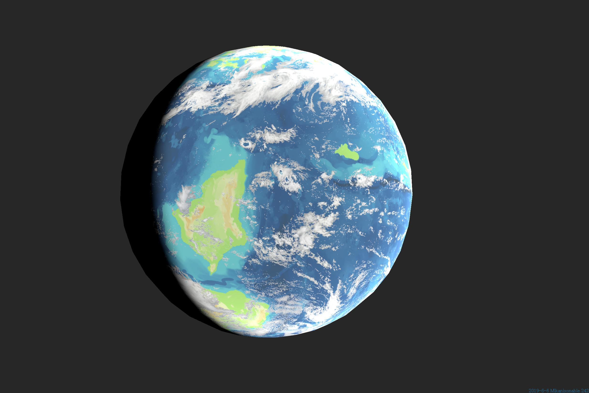
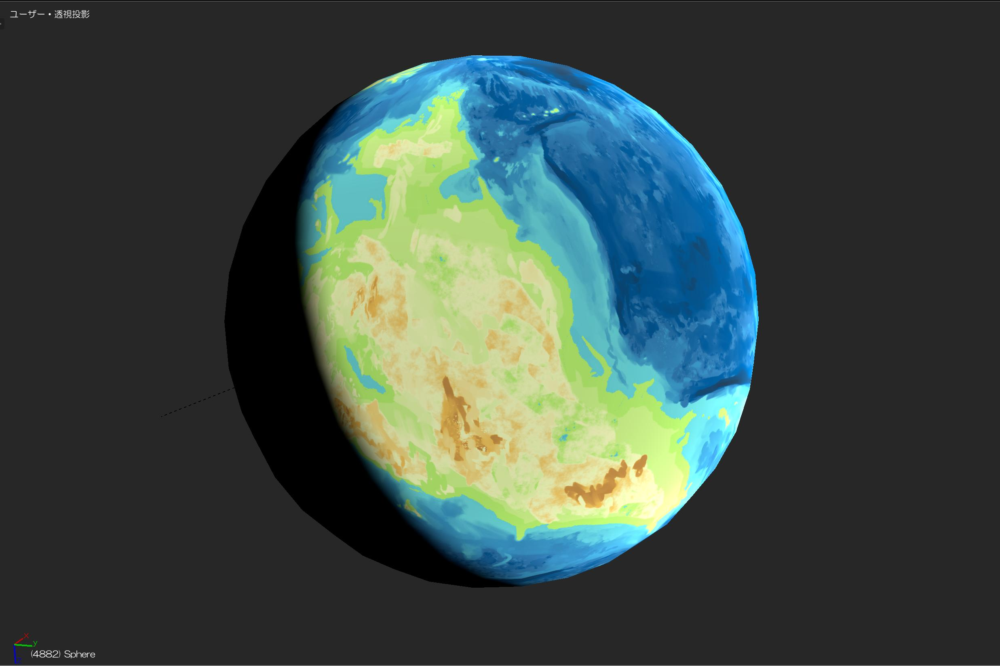

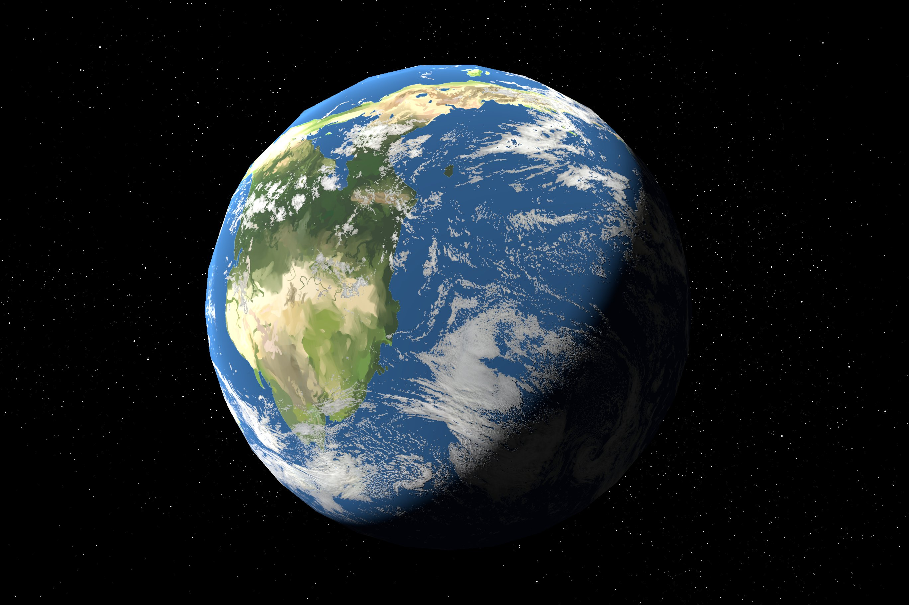
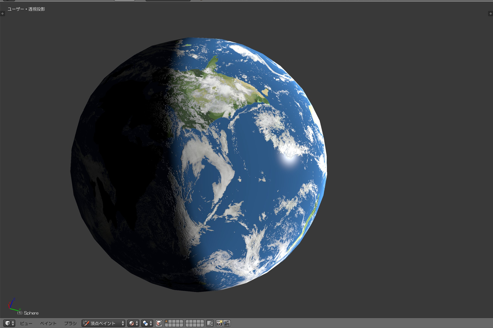

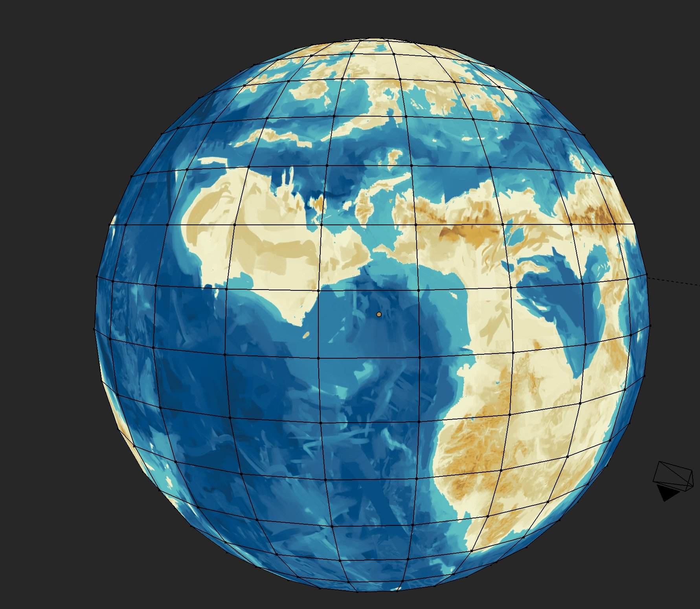
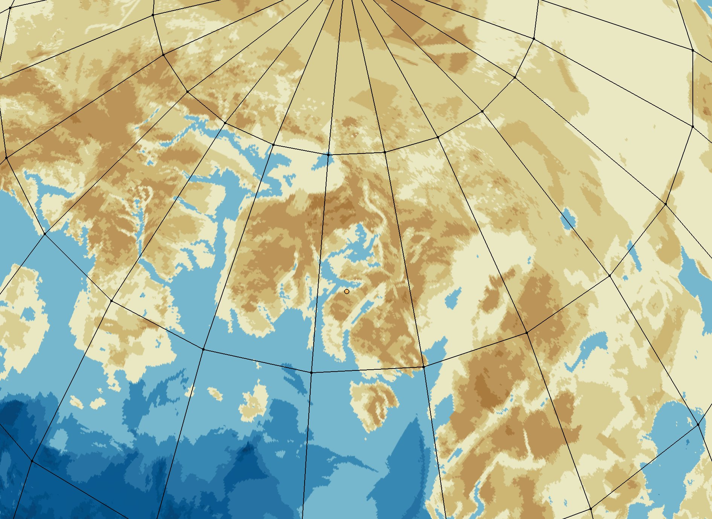
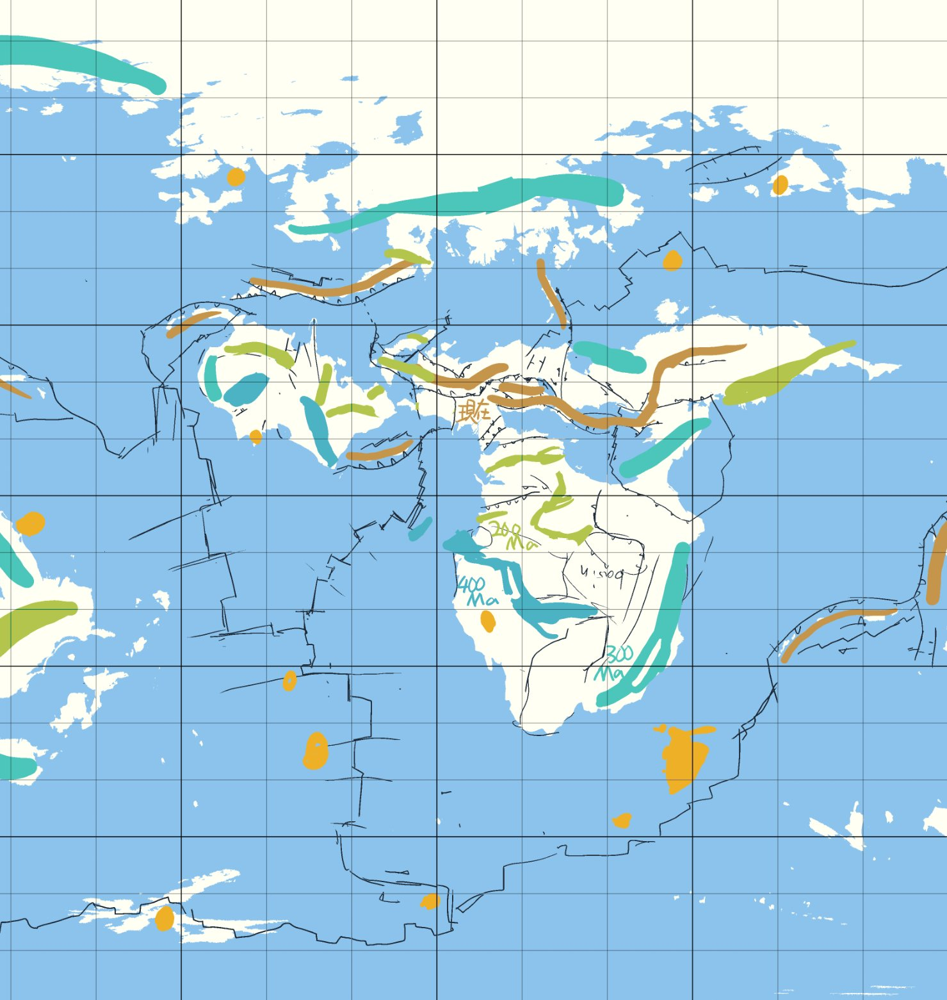

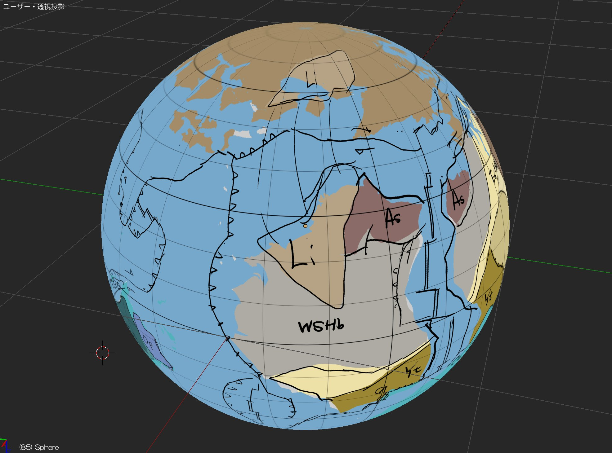
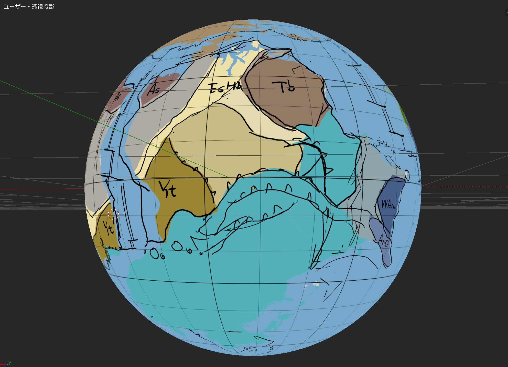
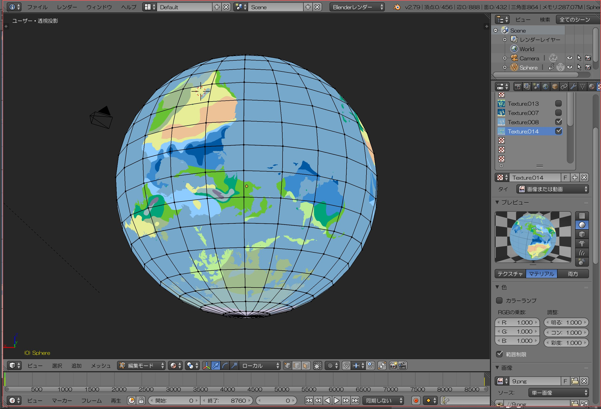
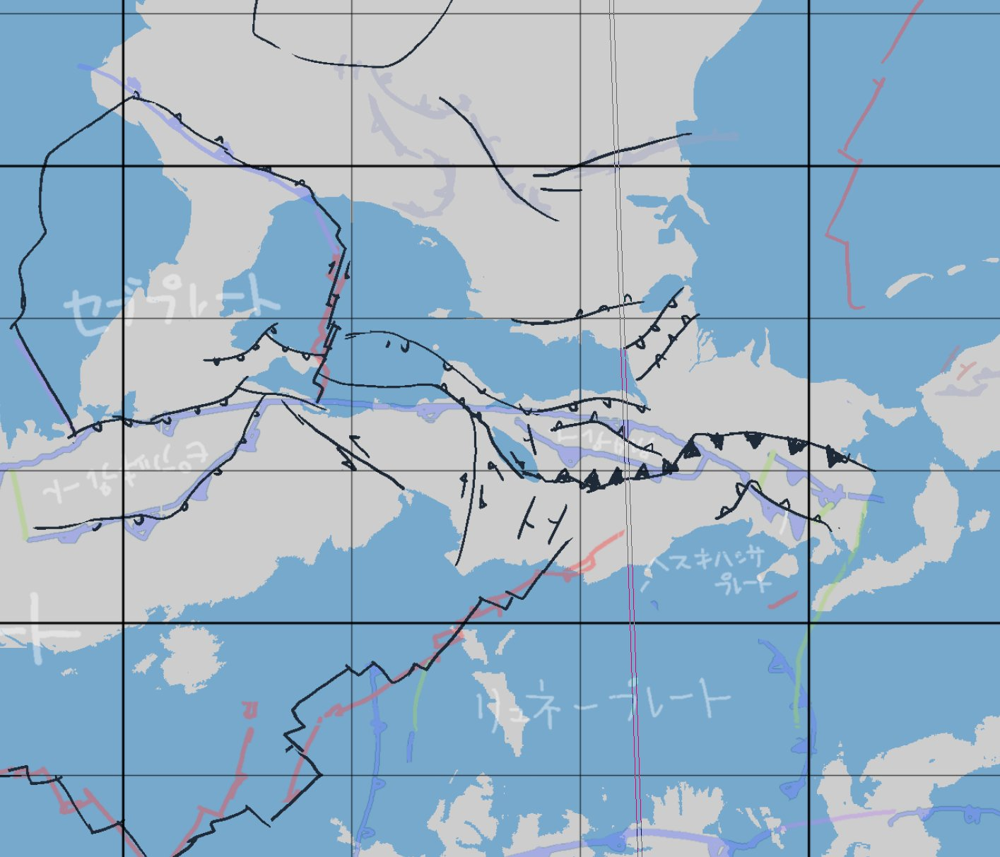
