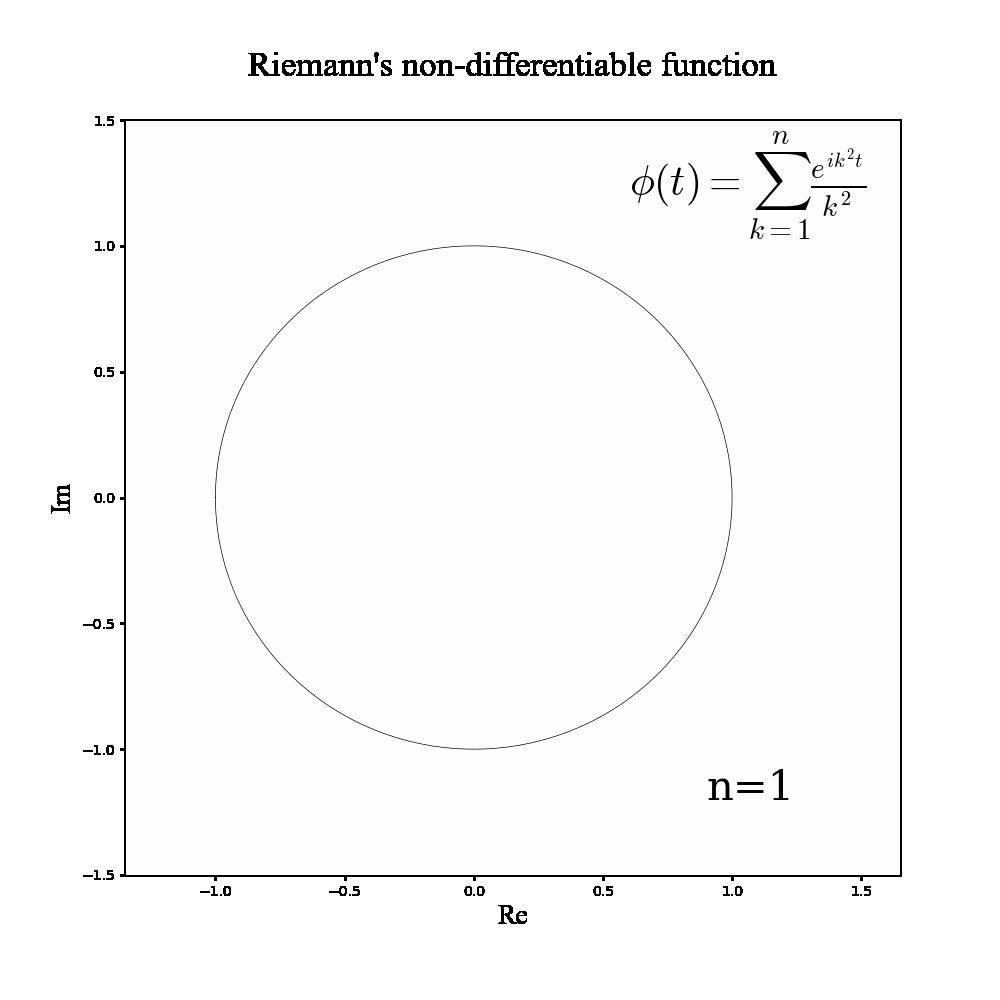

# リーマンの微分不可能関数の複素拡張をmatplotlibでプロットしアニメーションにする
#blog 

https://hyperion64.hatenadiary.org/entry/20120204/p1
↑何年か前、この記事で面白い自己相似曲線があることを知った(このブログではほかにもいろいろな自己相似曲線を扱っていて面白い)。
形がとてもかっこよくて気に入ったので年明け後にJSを使っていろいろページを作ったりした  
https://mikanixonable.github.io/80.html
https://mikanixonable.github.io/81.html
https://mikanixonable.github.io/82.html ←調節できる  

  
絵の背景に使ったりもした
https://twitter.com/Mikanixonable/status/1622960811013738497?s=20


しかしSNSに上げるにはgifとかの方がうれしいのでプロットしてみることにした  




#1000x1000のgifを描くプログラム
```python

#part-a
import random, numpy as np, math
from matplotlib import pyplot as plt
from matplotlib.animation import ArtistAnimation
from matplotlib.animation import FuncAnimation

def riemann(t,k):
    v = 0
    w = 0
    for i in range(k):
        v += np.cos(t*(i+1)**2)/((i+1)**2)
        w += np.sin(t*(i+1)**2)/((i+1)**2)
    return [v,w]
    
fig=plt.figure(figsize=(10,10))

def plot(k):
    plt.cla()
    t = np.arange(-np.pi,np.pi,0.0001)
    plt.plot(riemann(t,k+1)[0],riemann(t,k+1)[1],color="black",linewidth=0.5)
    
    plt.xlim(-1.35,1.65)
    plt.ylim(-1.5,1.5)
#     plt.xlim(0.5,1)
#     plt.ylim(0.5,1)
    plt.xlabel("Re",fontsize=20,fontfamily='Times New Roman')
    plt.ylabel("Im",fontsize=20,fontfamily='Times New Roman')
    
    plt.text(0.6,1.2,r'$\phi(t)=\sum_{k=1}^{n} \frac{e^{ik^2t}}{k^2}$',fontsize=30,math_fontfamily='cm')
    plt.text(0.9,-1.2,r'n={}'.format(k+1),fontsize=30,math_fontfamily='cm',fontfamily='serif')
    
    plt.title("Riemann's non-differentiable function\n",fontsize=25,math_fontfamily='cm',fontfamily='Times New Roman')


anim = FuncAnimation(fig, plot, frames=20,interval=500)
anim.save('Weierstrass-RiemannFunction5.gif', writer='pillow', dpi=100)

fig.show()

```


2000x2000の画像を描くプログラム
```python

#part-a
import random, numpy as np, math
from matplotlib import pyplot as plt
from matplotlib.animation import ArtistAnimation
from matplotlib.animation import FuncAnimation

def riemann(t,k):
    v = 0
    w = 0
    for i in range(k):
        v += np.cos(t*(i+1)**2)/((i+1)**2)
        w += np.sin(t*(i+1)**2)/((i+1)**2)
    return [v,w]
    
fig=plt.figure(figsize=(10,10),dpi=200)

def plot(k):
    plt.cla()
    t = np.arange(-np.pi,np.pi,0.0001)
    plt.plot(riemann(t,k+1)[0],riemann(t,k+1)[1],color="black",linewidth=0.5)
    
    plt.xlim(-1.35,1.65)
    plt.ylim(-1.5,1.5)
#     plt.xlim(0.5,1)
#     plt.ylim(0.5,1)
    plt.xlabel("Re",fontsize=20,fontfamily='Times New Roman')
    plt.ylabel("Im",fontsize=20,fontfamily='Times New Roman')
    
    plt.text(0.6,1.2,r'$\phi(t)=\sum_{k=1}^{n} \frac{e^{ik^2t}}{k^2}$',fontsize=30,math_fontfamily='cm')
    plt.text(0.9,-1.2,r'n={}'.format(k+1),fontsize=30,math_fontfamily='cm',fontfamily='serif')
    
    plt.title("Riemann's non-differentiable function\n",fontsize=25,math_fontfamily='cm',fontfamily='Times New Roman')
    
    plt.savefig('riemann.png')


plot(999)


```

https://arxiv.org/abs/1910.13191
ここの記事をみると虚部にπtを足すと別のかっこいい形になるらしいので描いた


その他、拡大  


数学gifBot凍結されてしまってとても悲しい

