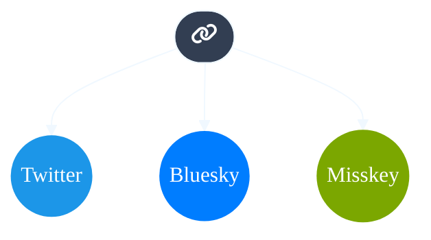

# 月面植物園
##### みかぶるのホームページ
> テクノなまこ、科学の力

[github repository](https://github.com/Mikanixonable/Mikanixonable.github.io)

## Link
### SNS
- [bluesky](https://bsky.app/profile/mikanixonable.bsky.social)
- [misskey](https://misskey.io/@Mikanixonable)
- [twitter](https://twitter.com/Mikanixonable)
- 
### Socials
- [blog](https://mikanixonable.hatenablog.com/)
- [spotify](https://open.spotify.com/user/cjsdijim4zllci0624b1wbak2)
- [pixiv](https://www.pixiv.net/users/20149051/illustrations)
- [AIみかぶる](https://twitter.com/Mikanixonable2)
- [Unicode Pod](https://twitter.com/Unicode_pod)
- [tumblr](https://mikanixonable.tumblr.com/)
- [kakuyomu](https://kakuyomu.jp/users/Eustralopithecus)
- [GitHub](https://github.com/Mikanixonable)

### その他
- [bento.me](https://bento.me/miku)

### テイラー展開
$$
f(x) = \sum_{n=0}^{\infty} \frac{f^{(n)}(a)}{n!}(x-a)^n
$$

~~~python
from matplotlib import pyplot as plt
import cv2 as cv2
import numpy as np

img = cv2.imread("1.png")
img = cv2.resize(img,(64,64))

print(img)
r = img[:,:,2]
g = img[:,:,1]
b = img[:,:,0]

rgb = np.dstack((r, g, b))
rgb_flat = rgb.reshape((rgb.shape[0]*rgb.shape[1], 3))
def rgb_to_hex(rgb):
    return '#{:02x}{:02x}{:02x}'.format(*rgb)
cCodes = np.apply_along_axis(rgb_to_hex, 1, rgb_flat)

# print(cCodes)
fig = plt.figure()
ax = fig.add_subplot(1, 1, 1, projection='3d')
ax.scatter(b, g, r, c=cCodes,alpha=1)
plt.show()
~~~

ma
~~~mermaid
graph TD
          A[fa:fa-twitter] -->|Get money| B(Go shopping)
          B --> C{Let me think}
          B --> G[/Another/]
          C ==>|One| D[Laptop]
          C -->|Two| E[iPhone]
          C -->|Three| F[fa:fa-car Car]
          subgraph section
            C
            D
            E
            F
            G
          end
~~~

\$\sqrt{2}\$

- 連絡 mikanixonable1@gmail.com

## 探検
- [site map](1)
- [旧トップ](300)

## コンテンツ
- [140](140)
- [141](141)
- [142](142)
- [notes](notes)

## 外部リンク
相互リンク
- [haxibami.net](https://haxibami.net/)
- [fabon.info](https://fabon.info)
- [sno2wman.net](https://sno2wman.net/)
- [ideoaves.github.io](https://ideoaves.github.io/)

## 編集用
- [チートシート]([https://github.com/pages-themes/leap-day/blob/master/index.md](https://itopaloglu83.github.io/Jekyll-Markdown-Cheat-Sheet/))
- [チートシート日本語](https://gist.github.com/mignonstyle/083c9e1651d7734f84c99b8cf49d57fa)

