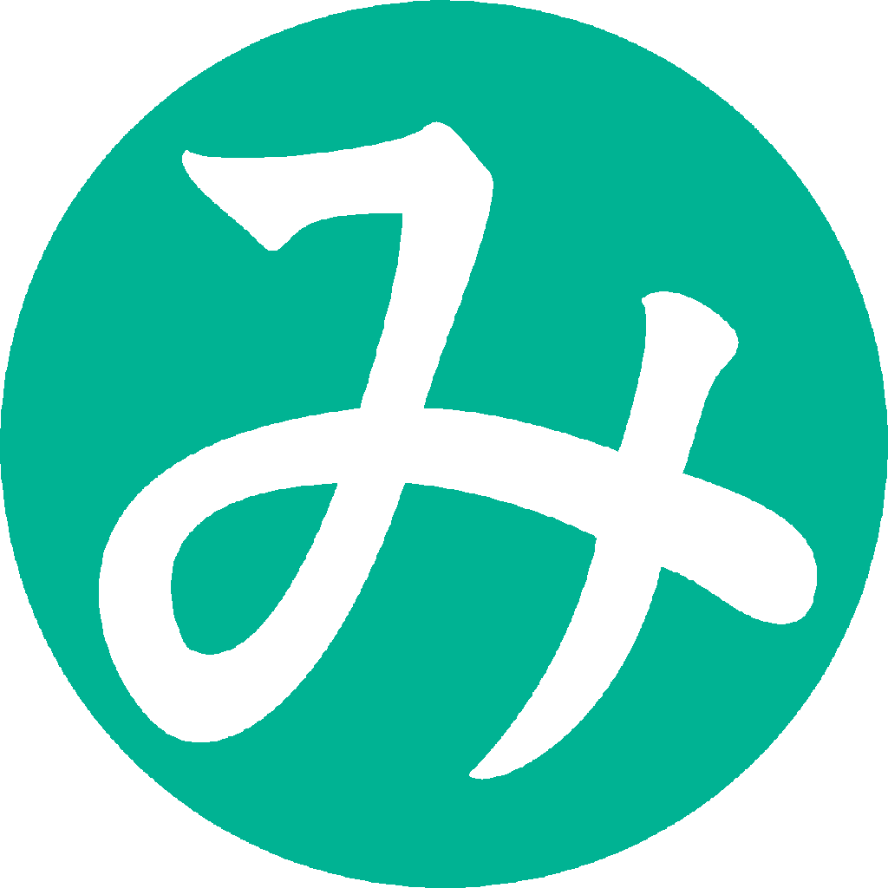

<svg version="1.1" baseProfile="full" width="84vw" height="50vw" viewbox="0 0 350 200" xmlns="http://www.w3.org/2000/svg">
<a href="https://twitter.com/Mikanixonable"><g transform="translate(60,60)"><circle cx="0" cy="0" r="50" fill="#1C96E8" />
<text x="-10" y="20" font-size="20" text-anchor="middle"alignment-baseline="central" fill="white">
Twitter</text></g></a>
<a href="https://bsky.app/profile/mikanixonable.bsky.social"><g transform="translate(40,135)"><circle cx="0" cy="0" r="25" fill="#007DFF" />
<text x="2" y="-8" font-size="13" text-anchor="middle"alignment-baseline="central" fill="white">
Bluesky</text></g></a>
<a href="https://misskey.io/@Mikanixonable"><g transform="translate(90,130)"><circle cx="0" cy="0" r="20" fill="#7BA700" />
<text x="-1" y="5" font-size="10" text-anchor="middle"alignment-baseline="central" fill="white">
Misskey</text></g></a>
<a href="https://open.spotify.com/user/cjsdijim4zllci0624b1wbak2"><g transform="translate(122,148)"><circle cx="0" cy="0" r="12" fill="#08a030" />
<text x="-1" y="5" font-size="8" text-anchor="middle"alignment-baseline="central" fill="white">
Spotify</text></g></a>
<a href="https://github.com/Mikanixonable">
<g transform="translate(140,100)"><circle rx="0" ry="0" r="20" fill="#333" />
<text x="10" y="0" font-size="15" text-anchor="middle"alignment-baseline="central" fill="white">
GitHub</text></g></a>
<a href="https://www.pixiv.net/users/20149051/illustrations">
<g transform="translate(270,100)"><circle cx="0" cy="0" r="30" fill="#0196FA" /><text x="0" y="0" font-size="17" text-anchor="middle"alignment-baseline="central" fill="white">
Pixiv</text></g></a>
<a href="https://mikanixonable.tumblr.com/">
<g transform="translate(245,50)"><circle cx="0" cy="0" r="22" fill="#102745" /><text x="0" y="0" font-size="10" text-anchor="middle"alignment-baseline="central" fill="white">
Tumblr</text></g></a>
<a href="https://discord.com/users/396122233698910218">
<g transform="translate(80,160)"><circle cx="0" cy="0" r="10" fill="#5865F2" /><text x="0" y="2" font-size="6" text-anchor="middle"alignment-baseline="central" fill="white">
Discord</text></g></a>
<a href="https://www.artstation.com/mikanixonable">
<g transform="translate(225,90)"><circle cx="0" cy="0" r="12" fill="#26a" /><text x="-2" y="0" font-size="6" text-anchor="middle"alignment-baseline="central" fill="white">
ArtStation</text></g></a>
<a href="https://mikanixonable.hatenablog.com/">
<g transform="translate(180,40)"><circle cx="0" cy="0" r="20" fill="#505259" /><text x="0" y="0" font-size="14" text-anchor="middle"alignment-baseline="central" fill="white">
Blog</text></g></a>
<a href="https://truthsocial.com/@mikanixonable">
<g transform="translate(70,147)"><circle cx="0" cy="0" r="5" fill="#42a" /><text x="0" y="0" font-size="3" text-anchor="middle"alignment-baseline="central" fill="white">
Truth</text></g></a>
<a href="https://iris.to/npub15m0s2qs5580f342d9endsuu464g974tmc7fqpdxdqt35zx9tqw9s6hy98w"><g transform="translate(66,115)"><circle cx="0" cy="0" r="5" fill="#603285" /><text x="0" y="0" font-size="3" text-anchor="middle"alignment-baseline="central" fill="white">
Nostr</text></g></a>  
<a href="https://www.instagram.com/mikanixonable/"><g transform="translate(310,150) rotate(50 0 0)"><circle cx="0" cy="0" r="10" fill="#CD1070" /><text x="10" y="0" font-size="8" text-anchor="middle"alignment-baseline="central" fill="white">
Instagram</text></g></a>
<a href="https://www.flickr.com/photos/196365191@N08/"><g transform="translate(305,120) rotate(0 0 0)"><circle cx="0" cy="0" r="8" fill="#0063DC" /><text x="3" y="0" font-size="6" text-anchor="middle"alignment-baseline="central" fill="white">
Flickr</text></g></a>
<a href="https://www.youtube.com/channel/UCQ02LvaZAbZAgAWBN5pYniA"><g transform="translate(270,155)"><circle cx="0" cy="0" r="20" fill="#FF0000" /><text x="0" y="0" font-size="8" text-anchor="middle"alignment-baseline="central" fill="white">
YouTube</text></g></a>
<a href="https://kakuyomu.jp/users/Eustralopithecus"><g transform="translate(20,105) rotate(0 0 0)"><circle cx="0" cy="0" r="8" fill="#2893CA" /><text x="5" y="1" font-size="5" text-anchor="middle"alignment-baseline="central" fill="white">
kakuyomu</text></g></a>
<a href="https://keybase.io/mikanixonable"><g transform="translate(235,163)"><circle cx="0" cy="0" r="8" fill="#FF6F21" /><text x="-3" y="0" font-size="6" text-anchor="middle"alignment-baseline="central" fill="white">
keybase</text></g></a>
<a href="https://bento.me/miku"><g transform="translate(150,70)"><circle cx="0" cy="0" r="6" fill="#888" /><text x="0" y="0" font-size="6" text-anchor="middle"alignment-baseline="central" fill="white">
bento</text></g></a>
<a href="https://soundcloud.com/mikanixonable"><g transform="translate(240,135)"><circle cx="0" cy="0" r="15" fill="#FF3902" /><text x="-7" y="-3" font-size="8" text-anchor="middle"alignment-baseline="central" fill="white">
SoundCloud</text></g></a>
<a href="https://www.nicovideo.jp/user/60514629/video"><g transform="translate(290,55)"><circle cx="0" cy="0" r="13" fill="#333" /><text x="0" y="0" font-size="6" text-anchor="middle"alignment-baseline="central" fill="white">
niconico</text></g></a>
<a href="https://www.tiktok.com/@mikanixonable"><g transform="translate(290,135)"><circle cx="0" cy="0" r="7" fill="#353050" /><text x="0" y="0" font-size="5" text-anchor="middle"alignment-baseline="central" fill="white">
TikTok</text></g></a>  
<a href="https://vrchat.com/home/user/usr_37713f32-f424-4242-86c2-b8cb7bcc2b3b"><g transform="translate(320,100)"><circle cx="0" cy="0" r="13" fill="#354e45" /><text x="0" y="0" font-size="6" text-anchor="middle"alignment-baseline="central" fill="white">
VRChat</text></g></a>
<a href="https://mstdn.jp/@Mikanixonable"><g transform="translate(105,100)"><circle cx="0" cy="0" r="8" fill="#3088D4" /><text x="0" y="-3" font-size="6" text-anchor="middle"alignment-baseline="central" fill="white">
mstdn</text></g></a>
<a href="https://twitter.com/Unicode_pod"><g transform="translate(50,173)"><circle cx="0" cy="0" r="8" fill="#288E9C" /><text x="-2" y="0" font-size="4" text-anchor="middle"alignment-baseline="central" fill="white">
Unicode pod</text></g></a>  
<a href="https://twitter.com/Mikanixonable2"><g transform="translate(105,178)"><circle cx="0" cy="0" r="8" fill="#8BAAAF" /><text x="2" y="0" font-size="4" text-anchor="middle"alignment-baseline="central" fill="white">
AIみかぶる</text></g></a>  
<text x="0" y="40" font-size="30"fill="white">
月面植物園</text>
<text x="4" y="60" font-size="15"fill="white">
みかぶるのホームページ</text>
</svg>

Mikanixonableの自己紹介（略式）

2016年ごろから、インターネット上で「みかぶる」と名乗り、絵や音楽や小説などを投稿しています。言及されると喜びます 
連絡: TwteerのDM/mikanixonable1@gmail.com

 

>テクノなまこ、科学の力

  ### ミクボタン（音が鳴ります）
  

    <button onclick="btn('1.mp3', this)">ミクボタン</button>
    <button onclick="btn('2.mp3', this)">ねう</button>
    <button onclick="btn('3.mp3', this)">Mazurek Dąbrowskiego</button>
    <button onclick="btn('4.mp3', this)">ねこーっ</button>
    <button onclick="btn('5.mp3', this)">ねこねこ</button>
    <button onclick="btn('6.mp3', this)">にゃう</button>
    <button onclick="btn('7.mp3', this)">ぬい~</button>
  

  ### 音楽視聴
  

    <button onclick="btn('8.mp3', this)">pikopiko tune</button>
    <button onclick="btn('9.mp3', this)">人のいない美術館</button>
    <button onclick="btn('10.mp3', this)">warabimochi</button>
    <button onclick="btn('11.mp3', this)">きのこの森での記録</button>
    <button onclick="btn('12.mp3', this)">game music 1</button>
    <button onclick="btn('13.mp3', this)">雨</button>
    <button onclick="btn('14.mp3', this)">土曜日のテーマ</button>
    <button onclick="btn('15.mp3', this)">piano matrix</button>
    <button onclick="btn('16.mp3', this)">piano matrix2</button>
    <button onclick="btn('17.mp3', this)">Tetete</button>
    <button onclick="btn('18.mp3', this)">台風のうた</button>
    <button onclick="btn('19.mp3', this)">時計台</button>
    <button onclick="btn('20.mp3', this)">対流圏</button>
  

## コンテンツ
- [サイトマップ](1) マークダウンからの生成ページはヒットしない、改修待ち
- [旧トップ](300)
- [140](140)
- [141](141)
- [142](142)
- [notes](notes)

## 相互リンク
- [ideoaves.github.io](https://ideoaves.github.io/)
- [haxibami.net](https://haxibami.net/)
- [fabon.info](https://fabon.info)
- [sno2wman.net](https://sno2wman.net/)

## バナー
  
>&lt;a href="">&lt;img src="https://mikanixonable.github.io/banner.png" width="200" height="40" alt="人造日本人" />&lt;/a>

このサイトはリンク自由です

~~~mermaid
flowchart TD
  a --> b --> c
~~~

## 一方的リンク
>ツイッターやMisskeyのFFの個人サイト

https://qmainconts.dev/  
https://sites.google.com/view/farascarrelhttps://www.haxibami.net/  
https://sno2wman.net/  
https://riq0h.jp  
https://gainencomphand.pages.dev/  
https://www.sapporo-posse.com/  
https://yuuri3.github.io/  
http://www2s.biglobe.ne.jp/~masamich/index.html  
http://ziphil.com/  
https://ziphil.com/other/other/11.html  
https://foldr.moe/  
https://foldr.moe/harp/  
http://nymwa.net/  
https://neriko.net/  
https://sksat.net  
https://ransewhale.net/  
https://kitakami7kouren.jimdofree.com/  
http://blz.x0.com/  
https://hundredburger.com/  
https://haibala.com/  
https://yuchiki.github.io/  
https://kepeken.github.io/  
https://reirisono.github.io/  
https://haar-you.github.io/  
https://enden-nix.github.io/  
https://kusakabeworks.net/  
https://sozysozbot.github.io/  
https://skytomo221.github.io/  
https://tachibana51.github.io/  
https://gfngfn.github.io/ja/  
https://notolyte.github.io/pensee/  
http://www.ximco.jp/  
https://kuina.ch/  
https://kawane.icu/  
http://kanto.me/xeno/  
https://www.fabon.info/  
https://ofni.necocen.info  
https://www.machinery-tomoko.com/  
http://souzoumap.starfree.jp/  
https://www.alz.jp/221b/index.html  
http://pref-karafuto.net/Index.html  
https://sites.google.com/site/syxobo/  
https://sites.google.com/site/moyacilang/  
https://sites.google.com/site/faraspalt/  
https://tomohironakano.com/tomohiro-nakano  
https://strv.dev/  
https://nbrkdrnfnht.zatunen.com/  

## 編集用
- [チートシート]([https://github.com/pages-themes/leap-day/blob/master/index.md](https://itopaloglu83.github.io/Jekyll-Markdown-Cheat-Sheet/))
- [チートシート日本語](https://gist.github.com/mignonstyle/083c9e1651d7734f84c99b8cf49d57fa)
- [github repository](https://github.com/Mikanixonable/Mikanixonable.github.io)

