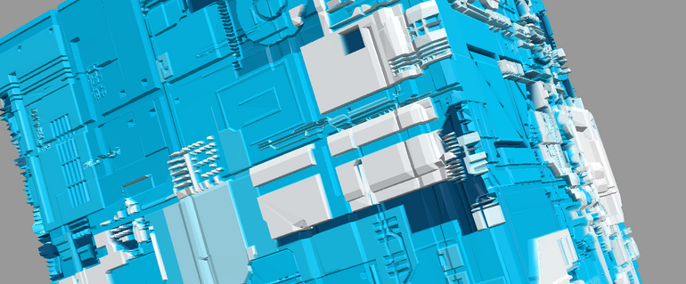

<blockquote>
  
テクノなまこ、科学の力

</blockquote>

  ### ミクボタン（音が鳴ります）
  

    <button onclick="btn('1.mp3', this)">ミクボタン</button>
    <button onclick="btn('2.mp3', this)">ねう</button>
    <button onclick="btn('3.mp3', this)">Mazurek Dąbrowskiego</button>
    <button onclick="btn('4.mp3', this)">ねこーっ</button>
    <button onclick="btn('5.mp3', this)">ねこねこ</button>
    <button onclick="btn('6.mp3', this)">にゃう</button>
    <button onclick="btn('7.mp3', this)">ぬい~</button>
    <button onclick="btn('21.mp3', this)">JR-SH3-3(東京駅)</button>
  

## コンテンツ
- [案内所](144)
- [サイトマップ](1)　マークダウンからの生成ページはヒットしない、改修待ち
- [イラスト](129)
- [旧トップ](100)
- [架空惑星ギャラリー](23)
- [写真](8)
- [旧インターネット目録](21)
- [インターネット目録](128)

<a href="./129" class="linkcard">イラスト</a>
<a href="./129" class="linkcard">VRChatで製作したワールド</a>
<a href="./129" class="linkcard">イラスト</a>
<a href="./129" class="linkcard">イラスト</a>

- 
- 

- [音楽コーナー](145)
- [このサイトについて](37)
- [リンク](142)
- [みかぶるについて](143)

## バナー
  
> 画像: https://mikanixonable.github.io/banner.png  

>タグ: &lt;a href="">&lt;img src="https://mikanixonable.github.io/banner.png" width="200" height="40" alt="月面植物園" />&lt;/a>

このサイトはリンク自由です

## 相互リンク
- [ideoaves.github.io](https://ideoaves.github.io/)
- [haxibami.net](https://haxibami.net/)
- [fabon.info](https://fabon.info)
- [sno2wman.net](https://sno2wman.net/)
>[まだ相互ではないリンク](142)

## 編集用

- [チートシート日本語](https://gist.github.com/mignonstyle/083c9e1651d7734f84c99b8cf49d57fa)

